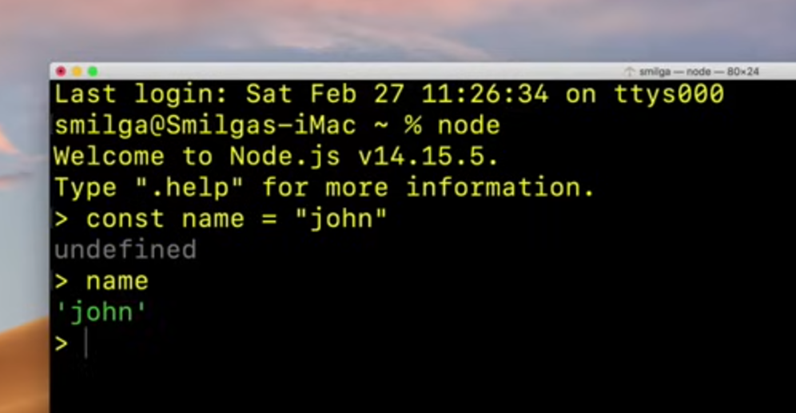

https://www.youtube.com/watch?v=Oe421EPjeBE&t=90s&ab_channel=freeCodeCamp.org

# What is node?
Enviornment to run JS outside Browser

YouTube-playlist: JS Nuggets (Coding Addict) - mye bra her generelt

Forskjell på Browser.js og Node.js:
1) Node JS har ingen tilgang til Browser API. Ingen DOM eller lignende
2) ES6 komdules hos browser, CommonJS hos Node.

# Intro

# Install

Gå tilnodejs.org, velg versjon, last ned og kjør.
Kjør ``node --version`` i terminal for å sjekke.

Lurt å bruke LTS-versjon (Long Term Support)

## REPL
How do we get ndoe to evaluate our code? Read Eval PrintLoop (REPL)

REPL for playing around, CLI for everything else.

How to spin up REPL?

Go to terminal and type `node`

Starts a REPL (plass å skrive kode sånn som når du starter python i terminal)



To close: ``Ctrl + C``

## CLI
Running our app code in node.

Create folder for project.

Navigate to folder in VSCode

Create new file in project. Call it app.js (later renamed to 1-intro.js)

```javascript
1-intro.js
const = amount = 12;

if (amount < 10) {
    console.log("small number"):
} else {
    console.log("large number");
}

console.log("Hey it's my first node app!")
```

To execute code, we have two options:
1) Go to terminal and navigate to project folder. Type `node app.js`
2) Open terminal in VSCode (`Ctrl + ø`) from app.js. Type in `node app.js`

www.johnsmilga.com has all the script files.

# Node Fundamentals
## Global Variables in Node

Let's go quickly through the most used global variables in node.

IN vanilla JS we have access to the window object where we can get a bunch of usefull things. Get elements, fetch etc.

There is no window in Node and we can't use Window. However, there are some global variables (you have access to them from anywhere in your node.js-code).

Some will be taught here, most will be skipped for now, but might come up during the course.

1) __dirname - path to current directory
2) __filename - file name
3) require - function to use modules (CommonJS)
4) module - info about current module (file)
5) process - info about environment where the program is being executed

require and module will be used shortly.  
Process is very useful as it gives information about the environment. This is very helpful when you move your app to a server (different environment)

How to use: `console.log(__direname);` will display the information available. (same for the rest)

```javascript
setInterval(() => {
    console.log("Hello world")
}, 1000)
```
setInterval kjører koden i arg1 med intervaller satt i arg2 [ms]. Koden ovenfor skriver derfor "Hello World" til konsoll hvert sekund. Stopp med `ctrl + c`

setTimeout er også noe som ble vist her.

## Modules in Node

In terminal we have: `node app.js`. Does all my code have to be inn this on file? Yes and no. Yes you start one file, but you can split your code and call other modules.

Let us build a small app:
```javascript
const secret = "super secret"
const john = "john"
const peter = "peter"


const sayHi = (name) 0> {
    console.log(`Hello there ${name}`);
}

sayHi("susan")
sayHi(john)
sayHi(peter)
```

Wouldn't it be smarter to have this code in its own file and then have it available for all programs?

Modules are encapsulated code and we are only sharing what we want.

Node uses CommonJS where every file in is a module (by default).

What to do:
Create a seperate file  e.g. names.js which contains 
```javascript
const secret = "super secret"
const john = "john"
const peter = "peter"
```
Create a second file called utils.js
```javascript
const sayHi = (name) 0> {
    console.log(`Hello there ${name}`);
}
```

The main app.js then contains
```javascript
sayHi("susan")
sayHi(john)
sayHi(peter)
```
which won't work due to sayHi is undefined.

Now, if we go back to names.js and add a console.log() for the global variabel module, we can learn more about the value-properties of this file.
```javascript
const secret = "super secret"
const john = "john"
const peter = "peter"

console.log(module)
```
We are then provided the following information

where exports are what the module exports. It is up to us to allow which values are exported and our "Super secret" can be contained locally

```javascript
// local
const secret = "super secret"

// shared
const john = "john"
const peter = "peter"

module.exports = {john, peter}
```

This allows us to access these variables in apps.js.

```javascript
const names = require("./names.js") 
console.log(names)


//sayHi("susan")
//sayHi(john)
//sayHi(peter)
```
to access local modules you have to start with "./" to indicate it is local.

Running apps.js will then give us


We can do this for utils.js as well.

```javascript
const sayHi = (name) 0> {
    console.log(`Hello there ${name}`);
}

module.exports = sayHi;
```

we can once again update apps.js

```javascript
const names = require("./names.js") 
const sayHi = require("./utils.js")
console.log(names)


sayHi("susan")
sayHi(john)
sayHi(peter)
```

This will give an error due to john being undefined. Ths can be changed in two ways. Either by setting
 ```javascript
const {john, peter} = require("./names.js") 
```

or by keeping `const names` as is and changing the call in sayHi()
```javascript
sayHi("susan")
sayHi(names.john)
sayHi(names.peter)
```

Either way apps.js should now work by importing variables and functions from modules using ``module.exports`` in the modules and ``require`` in the main script.

### Alternative syntax
When we export, we use `module.exports`. This can either be equal to a single value of a function. If we have multiple values we have defined an object `{john, peter}` which contains all values.

However, there is an alternative way to do this called export as you go.

```javascript
// filename: alternative-flavor.js
module.exports.items = ["item1", "item2"] // this exports the variable items
const person = {
    name: "bob",
}

module.exports.singlePerson = person // this is another way to export as you go
```

So, what are we doing here? module.exports is an object with properties. We are setting two properties (items and singlePerson) and providing each property with a value.

If we return to our main script we can now import the exports from alternative-flavor.js

```javascript
const names = require("./names.js") 
const sayHi = require("./utils.js")
const data = require("./alternative-flavor.js")

console.log(data)

sayHi("susan")
sayHi(names.john)
sayHi(names.peter)
```
Which gives


### Mind grenade

```javascript
// filename: mind-grenade.js
const num1 = 5;
const num2 = 10;

function addValues(){
    console.log("the sum is: ${num1 + num2}")
}

addValues();
```

If we return to app.js and write
```javascript
const names = require("./names.js") 
const sayHi = require("./utils.js")
const data = require("./alternative-flavor.js")

require("./mind-grenade.js")

//sayHi("susan")
//sayHi(names.john)
//sayHi(names.peter)
```

which will call the only function in the mind-grenade.js-module and write it to console. Even though we haven't exported it.

What is happening?

If we have a function in a module and we call it, the function will run even though we didn't assign it to a variable. 

We will use this setup sometimes in the course with third pary modules, but when that happens the lecturer will remind us.

The important thing to remember is that when one requires a module, one also envokes it. The reason why this happens is because in the mind-grenade.js-script we call the function.

## Built-in modules
Only a few modules and properties are covered. The list of built-in modules in Node is quite big. As a result we could easily spend a lot of time on this. But is that really beneficial? No. Let us do the most useful ones first, and learn more as we go. If you want to learn more, just go to the docs and go nuts (nodejs.org -> Docs).

### os-module

Let's dive into it by creating a file called modules.js:
```javascript
const names = require("./names.js") 
const sayHi = require("./utils.js")
const data = require("./alternative-flavor.js")

require("./mind-grenade.js")

//sayHi("susan")
//sayHi(names.john)
//sayHi(names.peter)
```

and then update apps.js:

```javascript
const os = require("os") //built-in module and therefore doesn't need to be installed and does'nt need "./" in front

// info about current user
const user = os.userInfo()
console.log(user)
```

When the lecturer runs the code abvoe, he receives


___

Note on modules, methods and properties. If we want to use any methods/properties of `os` we can eiter write
```javascript
const os = require("os")
os.hostname // Accessing the hostname method or property through the os object
```

or we could write
```javascript
const {hostname} = require("os")
hostname(); // Directly accessing the hostname method
```

Personally I prefer the first one as this gives a better overview of where the methods/properties originate. However, if it is widely used I could use the latter to write less.

____
Os also can give us information about the system uptime:
```javascript
const os = require("os") //built-in module and therefore doesn't need to be installed and does'nt need "./" in front

// info about current user
const user = os.userInfo()
console.log(user)

// method returns the system uptime in seconds
console.log("The System Uptime is ${os.uptime()} seconds")
```
which gives us


___
The os-module have more methods and properties. We wnat to collect a few of them in an object.

```javascript
const os = require("os") //built-in module and therefore doesn't need to be installed and does'nt need "./" in front

// info about current user
const user = os.userInfo()
console.log(user)

// method returns the system uptime in seconds
console.log("The System Uptime is ${os.uptime()} seconds")

const currentOS = {
    name:os.type(),
    release:os.release(),
    totaltMem:os.totalmem(),
    freeMem:os.freemem(),
}

console.log(currentOS)
```


### Path module
Path gives us information about our server.

```javascript
const path = require("path)
```

# Express Tutorial

# Building apps...